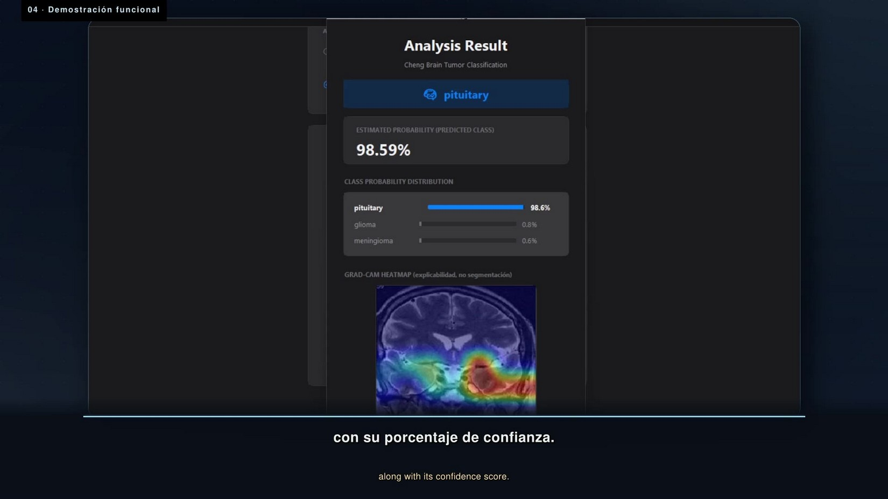
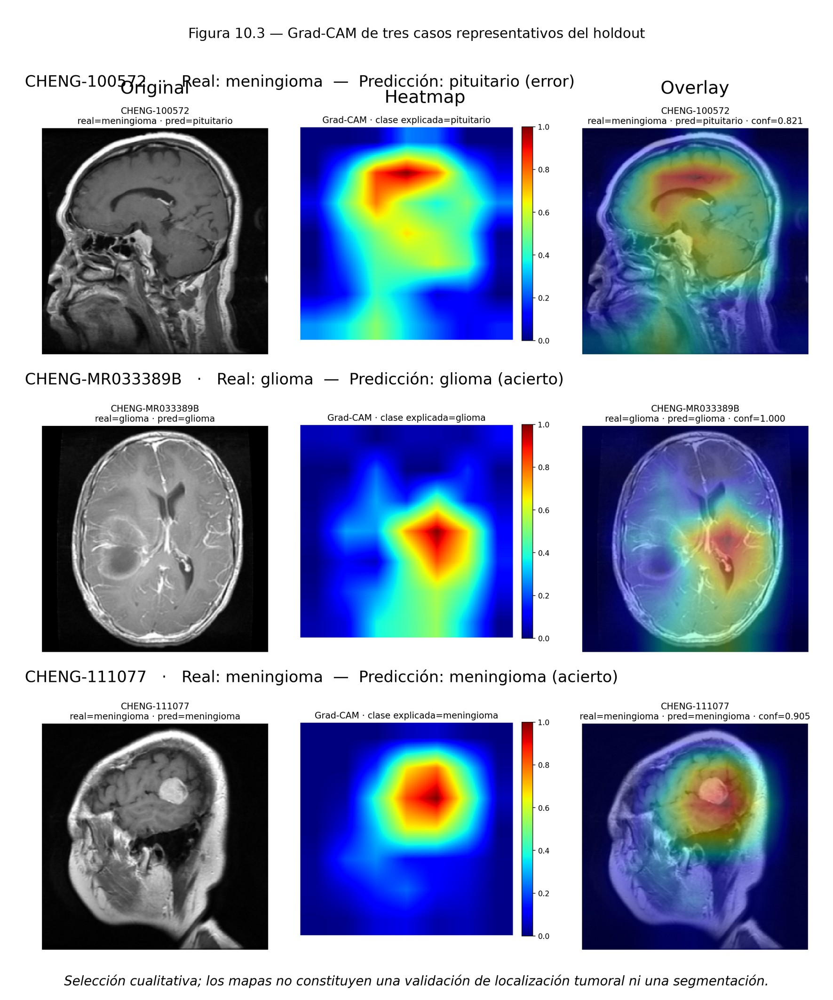

**Langue :** [Español](README.md) · [English](README.en.md) · **Français**

# Classification multiclasse des tumeurs cérébrales en IRM par apprentissage profond

**Travail de fin d'études (TFG)** · Licence en Génie Informatique – Génie Logiciel · Université de Séville (ETSII), 2026
Auteur : **Joaquín González Rodríguez** · Directeur : José Cristóbal Riquelme Santos · Codirecteur : Manuel Carranza García

Ce dépôt réunit **tout le nécessaire pour comprendre, reproduire et réutiliser** le TFG : le pipeline d'entraînement avec traçabilité par patient, les partitions figées, les protocoles expérimentaux, les résultats, un service d'inférence sur **Google Cloud Run** et une **application de bureau** qui l'utilise.

> ⚠️ **Usage exclusivement expérimental et pédagogique.** Le modèle a été évalué au sein d'une seule cohorte publique (Cheng et al., 233 patients), **sans validation externe ni clinique**. Ce n'est pas un dispositif médical et il ne doit servir à diagnostiquer personne.

> Le mémoire et les annexes (PDF), les protocoles expérimentaux et les commentaires du code sont en **espagnol**. Les guides de [`docs/fr/`](docs/fr) les résument en français.

---

## En 30 secondes

| | |
|---|---|
| **Tâche** | Classer une coupe d'IRM T1 avec produit de contraste en **gliome**, **méningiome** ou **tumeur hypophysaire** |
| **Données** | [Cheng et al. (figshare)](https://doi.org/10.6084/m9.figshare.1512427) · 233 patients · 3 064 coupes · CC BY 4.0 |
| **Modèle final** | **ResNet50** pré-entraîné sur ImageNet + ajustement fin des 20 dernières couches (ResNet50‑FT) |
| **Unité d'évaluation** | Le **patient** (moyenne des probabilités de ses coupes + argmax) |
| **Test réservé (35 patients, évalué une seule fois)** | Balanced accuracy **93,89 %** · Accuracy 94,29 % · Macro‑F1 93,98 % · IC 95 % bootstrap [84,26 %, 100 %] |
| **Validation croisée à 5 plis (233 patients)** | Balanced accuracy **89,44 % ± 4,64 pts** entre plis · 88,68 % sur les 233 prédictions agrégées |
| **Démo** | [Vidéo (2 min, sous-titres ES/EN)](https://youtu.be/QgTOD3KOTpI) |

<p align="center"> </p>

## En quoi ce projet peut vous être utile

Au-delà du chiffre de performance, la valeur de ce TFG réside dans **la manière** d'y parvenir. Si vous allez entraîner un CNN sur des images médicales, voici les erreurs que le projet a rencontrées (et corrigées) en chemin :

1. **Découper par image plutôt que par patient.** Les jeux de données agrégés de Kaggle ne contiennent pas d'identifiant de patient : des coupes d'un même patient peuvent se retrouver à la fois en entraînement et en test. Ici, le jeu de données a été reconstruit à partir des sources primaires en utilisant le `PID` réel de chaque fichier.
2. **Biais de provenance.** La tâche binaire « tumeur / pas de tumeur » combinait Cheng (tumeur) et IXI (sain). Un classifieur utilisant **seulement 10 descripteurs de bas niveau, sans réseau de neurones**, a obtenu **98,16 %** d'accuracy : l'étiquette coïncidait avec l'hôpital d'origine. C'est pourquoi le projet a été réorienté vers la classification multiclasse au sein d'une seule cohorte.
3. **Ouvrir le test plusieurs fois.** Ici, le protocole d'évaluation a été rédigé et figé avec son hash *avant* d'ouvrir le test, et le test n'a été évalué qu'une seule fois.

Tout cela est expliqué pas à pas dans [`docs/fr/01_historique_du_projet.md`](docs/fr/01_historique_du_projet.md).

---

## Structure du dépôt

```
detector-tumores-cnn/
├── docs/                      Documentation : mémoire et annexes complets (PDF, espagnol) + guides
│   ├── *.md                          Guides en espagnol
│   ├── en/                           Guides en anglais
│   ├── fr/                           Guides en français
│   │   ├── 01_historique_du_projet.md     Évolution, problèmes détectés et décisions
│   │   ├── 02_donnees.md                  Sources, licences, manifeste, doublons, partition
│   │   ├── 03_methodologie.md             Prétraitement, architectures, entraînement, métriques, Grad-CAM
│   │   ├── 04_resultats.md                Tous les tableaux de résultats
│   │   ├── 05_guide_reproduction.md       ★ Recréer l'entraînement pas à pas
│   │   ├── 06_deploiement_google_cloud.md ★ Monter votre propre Cloud Run + application de bureau
│   │   └── 07_limites_et_ethique.md
│   └── protocolos/                   Protocoles C.1–C.4 tels que figés avant chaque expérience
├── training/                  Code d'entraînement et d'évaluation
│   ├── notebooks/             Notebooks originaux du pipeline (Colab / HPC)
│   ├── robustez_5cv/          Scripts et fichiers SLURM originaux de la validation croisée à 5 plis
│   ├── slurm/                 Script SLURM du benchmark multiclasse
│   ├── herramientas/          construir_manifest_cheng.py (ajouté pour le dépôt)
│   └── entrenar_modelo_final.py      Réimplémentation du protocole C.1 (ajouté pour le dépôt)
├── data/                      Partition figée par patient + plis 5CV (sans images)
├── results/                   Résultats de la validation 5CV (JSON/CSV)
├── cloud-run-backend/         API Flask d'inférence (service run-model)
├── desktop-client/            Application de bureau Tkinter
└── legacy/scania/             Prototype historique d'interface (référence uniquement)
```

## Pour commencer

**Je veux seulement comprendre le travail** → lisez [`docs/fr/01_historique_du_projet.md`](docs/fr/01_historique_du_projet.md) et [`docs/fr/04_resultats.md`](docs/fr/04_resultats.md), ou le mémoire complet [`docs/TFG_Joaquin_Gonzalez_Rodriguez_memoria.pdf`](docs/TFG_Joaquin_Gonzalez_Rodriguez_memoria.pdf) (en espagnol).

**Je veux réentraîner le modèle** → [`docs/fr/05_guide_reproduction.md`](docs/fr/05_guide_reproduction.md). Version courte :

```bash
cd training
pip install -r requirements.txt            # Python 3.10, TensorFlow 2.15.1
python herramientas/construir_manifest_cheng.py --root ./tfg_run --split ../data/splits/split_multiclase_cheng.csv
python entrenar_modelo_final.py --root ./tfg_run   # quelques minutes sur un GPU de type A30 ; des heures sur CPU
```

**Je veux déployer l'API et utiliser l'application** → [`docs/fr/06_deploiement_google_cloud.md`](docs/fr/06_deploiement_google_cloud.md).

## Modèles entraînés

Les poids ne sont pas stockés dans git (le modèle final pèse ~170 Mo et GitHub n'accepte pas les fichiers de plus de 100 Mo). Ils sont publiés dans la section **Releases** du dépôt :

| Fichier | Modèle |
|---|---|
| `resnet50_ft_cheng_final.h5` | ResNet50‑FT multiclasse servi par le service `run-model` |
| `brain_tumor_cnn.h5` | CNN binaire historique (affecté par le biais de provenance ; démo uniquement) |

## Ce qui est original et ce qui a été ajouté

Pour que personne ne confonde ce qui a produit les résultats du TFG avec ce qui a été préparé ensuite pour la publication :

| Type | Fichiers |
|---|---|
| **Artefacts originaux du TFG** (non modifiés) | `training/notebooks/*.ipynb`, `training/robustez_5cv/*`, `training/slurm/*`, `data/splits/*`, `results/robustez_5cv/*`, `docs/protocolos/*`, `docs/*.pdf`, `legacy/scania/*`, `cloud-run-backend/main.py` |
| **Ajouté pour le dépôt** | `training/herramientas/construir_manifest_cheng.py`, `training/entrenar_modelo_final.py`, tous les fichiers `README*.md` et les guides de `docs/`, `desktop-client/main.py` (seule la configuration change : chemins relatifs au lieu d'absolus, URL/buckets configurables par variables d'environnement), `cloud-run-backend/Procfile` |

Le notebook exact qui a exécuté l'ajustement fin et l'évaluation finale (jobs 70929–70931) **n'a pas été conservé** (annexe A.3). `entrenar_modelo_final.py` reconstruit ce protocole à partir du protocole C.1 et du script réel de la validation 5CV, qui utilise exactement la même recette.

## Comment citer

```
González Rodríguez, J. (2026). Clasificación multiclase de tumores cerebrales en imágenes de
resonancia magnética mediante aprendizaje profundo [Travail de fin d'études]. Universidad de Sevilla.
```

Si vous utilisez les données, citez aussi la source originale : Cheng, J. (2024). *Brain Tumor Dataset.* figshare. https://doi.org/10.6084/m9.figshare.1512427.v8 (CC BY 4.0), ainsi que l'article que les auteurs demandent de citer sur la page du jeu de données.
