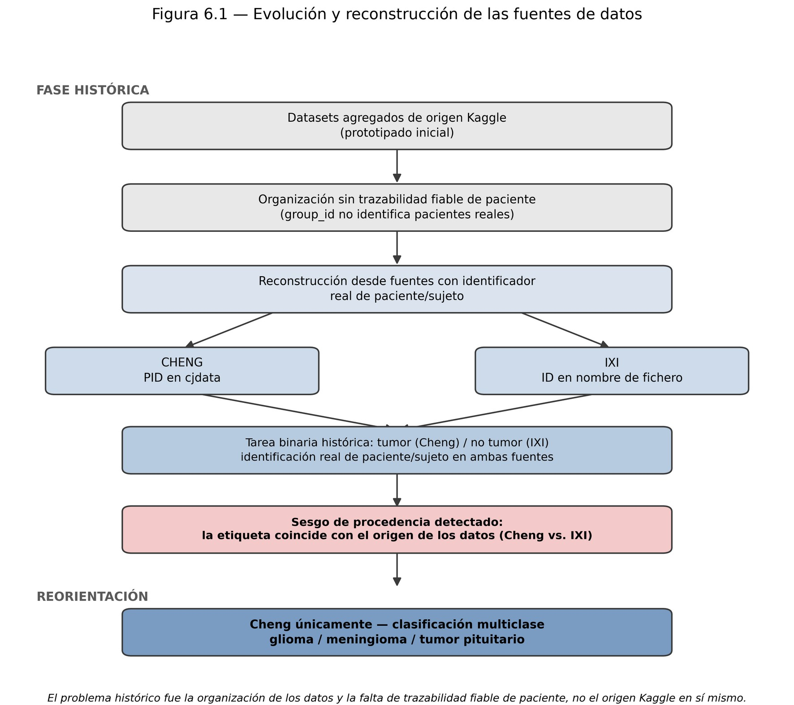

**Idioma:** **Español** · [English](en/01_project_history.md) · [Français](fr/01_historique_du_projet.md)

# 1. Historia del proyecto: qué salió mal y cómo se corrigió

Este TFG no siguió un plan lineal. Su resultado más útil para otras personas es precisamente el camino: tres decisiones metodológicas que cambiaron el proyecto y que cualquiera que trabaje con imágenes médicas debería conocer.

Fuente: capítulos 1, 4 y 6 de la [memoria](TFG_Joaquin_Gonzalez_Rodriguez_memoria.pdf).

## Etapa 1 — Prototipo con datos de Kaggle (sep. 2025 – jul. 2026)

Las primeras versiones del clasificador se entrenaron con colecciones de RM agregadas y redistribuidas en Kaggle, organizadas en carpetas por clase. Sirvieron para aprender el problema, montar la infraestructura de entrenamiento y probar una primera interfaz (el prototipo *ScanIA*, ver [`legacy/scania`](../legacy/scania)).

**El problema:** ninguna de esas fuentes conservaba el identificador del paciente. El pipeline usaba un `group_id` sacado del nombre del fichero como si fuera el paciente, pero no había forma de comprobarlo. Con esa organización **no se podía garantizar** que cortes del mismo paciente no aparecieran a la vez en entrenamiento y en test.

> No se demostró una fuga de información; se detectó un **riesgo estructural** que impedía descartarla. Esa diferencia es importante, y es la que motivó rehacer los datos en lugar de parchearlos.

## Etapa 2 — Reconstrucción con identificador real de paciente (ago. 2026)

El dataset se reconstruyó desde las **fuentes primarias**, que sí publican quién es cada paciente:

| Clase | Fuente | Identificador de paciente | Licencia |
|---|---|---|---|
| tumor | Cheng et al. — figshare | campo `cjdata.PID` dentro de cada `.mat` | CC BY 4.0 |
| sin tumor | IXI — Imperial College London | ID de sujeto en el nombre del NIfTI (`IXI002-Guys-0828-T1`) | CC BY-SA 3.0 |

Resultado: **467 pacientes reales** (233 Cheng + 234 IXI) y 5.872 imágenes, con un manifiesto (`manifest_final.csv`) que registra para cada imagen su paciente, fuente, SHA‑256 y subconjunto. Se añadieron controles automáticos: ningún paciente en dos subconjuntos, SHA‑256 únicos y detección de casi-duplicados (pHash + SSIM). La ejecución completa se automatizó en el clúster HPC de la Universidad de Sevilla (job 70436, 28 min en una NVIDIA A30).

## Etapa 3 — El sesgo de procedencia (y por qué se abandonó la tarea binaria)

Sobre el dataset reconstruido, la tarea binaria "tumor / no tumor" dio una balanced accuracy del **98,57 %**. Parecía un éxito. No lo era:

- Todo tumor venía de Cheng (T1 **con** contraste, dos hospitales chinos).
- Todo sano venía de IXI (T1 **sin** contraste, hospitales de Londres).
- **La etiqueta coincidía exactamente con el dataset de origen.**

Para comprobarlo se entrenó un clasificador de control con **solo 10 descriptores estadísticos y de textura, sin ninguna red neuronal**: obtuvo **98,16 %** de accuracy y 99,55 % de AUC. Si algo tan simple separa las clases, la red no necesita "ver" el tumor: le basta con reconocer el hospital. Otro control lo confirmó: un clasificador fue capaz de distinguir el **centro de adquisición dentro de IXI** (todo sujetos sanos) con un 89,32 % de accuracy.

> **Lección:** si tus clases positivas y negativas vienen de datasets distintos, tu modelo puede estar aprendiendo el escáner, no la enfermedad. Construye siempre un clasificador de control "tonto" antes de celebrar.

## Etapa 4 — Reorientación a clasificación multiclase dentro de una sola cohorte

El núcleo del TFG pasó a ser distinguir **glioma, meningioma y tumor pituitario** dentro de Cheng. Al venir las tres clases de la misma cohorte, desaparece la asociación determinista entre clase y dataset. No desaparece *todo* posible atajo: el mismo control de bajo nivel obtiene un 69,22 % en esta tarea (por encima del azar, 33 %), así que dentro de Cheng también hay señal de bajo nivel. Se documenta como limitación, no se oculta.

Se congeló un split por paciente **163 / 35 / 35** (train / val / test) con huella `fda7e2daeb9ec2de…`. Los 35 pacientes de test quedaron **bloqueados** hasta el final.

## Etapa 5 — Selección de arquitectura, evaluación única y validación 5CV (sep. 2026)

1. **Benchmark** de 5 arquitecturas preentrenadas (VGG16, ResNet50, MobileNetV2, EfficientNetB0, InceptionV3) con validación cruzada agrupada por paciente de 3 folds sobre los 198 pacientes de train+val.
2. **Ajuste fino** de los dos mejores (ResNet50, InceptionV3) y **fusión** 50/50, cada paso con su protocolo escrito *antes* de ejecutarlo ([`protocolos/`](protocolos)).
3. **Protocolo de evaluación final** escrito y hasheado → entrenamiento final → **test evaluado una sola vez**: 93,89 % de balanced accuracy.
4. **Validación cruzada de 5 folds** sobre los 233 pacientes para medir la variabilidad: 89,44 % ± 4,64 pp. El resultado del test queda cerca del extremo superior del rango, por lo que la cifra de 5CV es la estimación más prudente.

## Etapa 6 — Servicio en la nube y aplicación de escritorio (sep. 2026)

El modelo final se sirve desde un servicio **Cloud Run** (`run-model`) y una aplicación de escritorio en Tkinter permite subir una imagen o un volumen NIfTI y ver la predicción, el mapa Grad-CAM y un visor 3D. Un fallo real de producción (errores 503 por falta de memoria al cargar varias copias del modelo) se diagnosticó y corrigió; está documentado en [06_despliegue_google_cloud.md](06_despliegue_google_cloud.md#problema-conocido-error-503).

## Esfuerzo

306 h registradas en 101 sesiones (Clockify). El paquete que más se desvió de la estimación inicial fue **datos y trazabilidad** (63 h frente a 25 h previstas, +152 %): la reconstrucción del dataset no estaba prevista y fue la parte más valiosa del trabajo.
