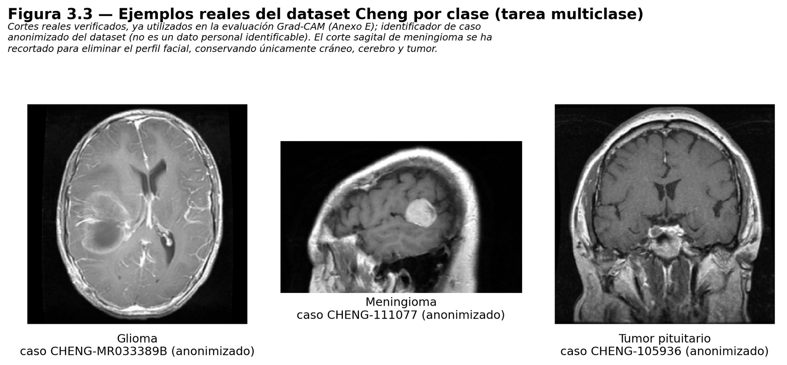

# 2. Datos

Este repositorio **no contiene imágenes médicas**. Contiene la información necesaria para descargarlas de sus fuentes oficiales y reconstruir exactamente el mismo reparto por paciente.

Fuente: capítulo 6 de la memoria y Anexos A y H de los [anexos técnicos](TFG_Joaquin_Gonzalez_Rodriguez_anexos.pdf).

## 2.1 Dataset usado en el resultado final: Cheng et al. (figshare)

| | |
|---|---|
| DOI | [10.6084/m9.figshare.1512427](https://doi.org/10.6084/m9.figshare.1512427) |
| Licencia | CC BY 4.0 (verificada con reserva, ver [07_limitaciones_y_etica.md](07_limitaciones_y_etica.md)) |
| Contenido | 3.064 cortes de RM **T1 con contraste** de **233 pacientes**, adquiridos en el Nanfang Hospital y el General Hospital de la Tianjin Medical University |
| Formato | 4 ZIP con ficheros `.mat` (MATLAB v7.3 / HDF5). Cada uno contiene `cjdata.label`, `cjdata.PID`, `cjdata.image`, `cjdata.tumorMask`, `cjdata.tumorBorder` |
| Etiquetas | `1` = meningioma, `2` = glioma, `3` = tumor pituitario |

Ficheros y MD5 publicados (el script los verifica automáticamente):

| ZIP | file_id | MD5 |
|---|---|---|
| brainTumorDataPublic_1-766.zip | 3381290 | `74b949ad33f042e6e103523091cd1428` |
| brainTumorDataPublic_767-1532.zip | 3381296 | `7e8a875500d2c8a346f270538e29890e` |
| brainTumorDataPublic_1533-2298.zip | 3381293 | `8227bf6080cb71f15a88be8d25c79ae7` |
| brainTumorDataPublic_2299-3064.zip | 3381302 | `b378a80d6174e5317d59eb28430c6652` |

<p align="center"></p>

### Distribución

| Clase | Pacientes | Cortes | Train | Val | Test |
|---|---|---|---|---|---|
| Glioma | 89 | 1.426 | 63 | 14 | 12 |
| Meningioma | 82 | 708 | 62 | 10 | 10 |
| Pituitario | 62 | 930 | 38 | 11 | 13 |
| **Total** | **233** | **3.064** | **163** (2.091 cortes) | **35** (499) | **35** (474) |

Las clases están desequilibradas y además el nº de cortes por paciente varía mucho (de 1 a 38, mediana 13). Por eso la métrica principal es la **balanced accuracy a nivel de paciente**.

## 2.2 Dataset IXI (solo tarea binaria histórica)

Se usó únicamente como clase "sin tumor" en la tarea binaria que se acabó descartando por sesgo de procedencia. Licencia **CC BY-SA 3.0**. El notebook `02` intenta descargarlo del servidor de Imperial College y, si este devuelve 403, recurre al registro [Zenodo 7047668](https://zenodo.org/records/7047668), que redistribuye volúmenes T1 de IXI con MD5 por fichero. **No es necesario para reproducir el resultado multiclase.**

## 2.3 Preprocesado de cada corte (igual para todo el proyecto)

Implementado en la función `_a_png` del notebook y copiado sin cambios en `training/herramientas/construir_manifest_cheng.py`:

1. Normalización por percentiles 1–99 al rango [0, 1].
2. **Recorte a la caja del cerebro**: píxeles por encima del 10 % → caja cuadrada centrada con un 4 % de margen.
3. Redimensionado a 256×256 (LANCZOS) y guardado como PNG de 8 bits en escala de grises.
4. En el entrenamiento: redimensionado a 224×224, réplica del canal gris a 3 canales y `preprocess_input` de ResNet50.

## 2.4 El manifiesto

`manifest_final.csv` es el contrato de entrada del pipeline: una fila por imagen. Esquema de columnas en [`data/manifest_template.csv`](../data/manifest_template.csv):

`local_file, label, patient_id, patient_id_source, volume_id, slice_id, view, source_dataset, source_url, original_file, site, tumor_type, modality, sha256, phash, width, height, duplicate_cluster, subset`

El manifiesto original no se publica (contiene rutas del clúster y las filas de IXI). El script `construir_manifest_cheng.py` genera uno equivalente para Cheng.

## 2.5 Controles de fuga de información

- **Disjunción de `patient_id`** entre train, val y test, y entre folds de cada validación cruzada.
- **SHA‑256 único** por imagen (0 duplicados exactos en las 5.872 imágenes).
- **Casi-duplicados**: pHash de 256 bits (distancia de Hamming ≤ 12) + confirmación SSIM ≥ 0,92. Resultado: **0 casi-duplicados confirmados** (ni entre fuentes, ni entre clases, ni entre pacientes). Nunca se borró nada de forma destructiva.

## 2.6 Split congelado y huellas de integridad

El split por paciente está en [`data/splits/split_multiclase_cheng.csv`](../data/splits/split_multiclase_cheng.csv) (y `.json`). Su huella se calcula así:

```python
pac = cheng.groupby("patient_id").agg(subset=("subset","first"), tumor_type=("tumor_type","first"))
pac = pac.reset_index().sort_values("patient_id")
sha256(pac[["patient_id","subset","tumor_type"]].to_csv(index=False).encode()).hexdigest()
# -> fda7e2daeb9ec2de596e807728454329cd140398dd10f834599457eca86c0092
```

Todas las ejecuciones cargan el split y **se detienen si la huella no coincide**, en lugar de generar un reparto nuevo. Huellas documentadas (Anexo H.3):

| Artefacto | Huella |
|---|---|
| Split multiclase 163/35/35 | `fda7e2daeb9ec2de596e807728454329cd140398dd10f834599457eca86c0092` |
| Folds 5CV (`folds_master.json`) | `cf13cf8e661f3f010bbe3761ebf3ec09a8c4f9b879aceb55b2f8a169e5945674` |
| Folds 5CV (hash semántico) | `985d9fc941ac672c9226a434ee31bbd827c2dc063e12e28b0235a5bd2550ce72` |
| Manifiesto original completo (5.872 filas) | `c468eb4e057dfab9b883b73c59e959f6194b0c46037df6b7cef22c9b2e5e6487` |

Los 5 folds de la validación de robustez están en [`data/splits/robustez_5cv/`](../data/splits/robustez_5cv) y se regeneran **byte a byte** con `preparar_5cv_robustez.py` usando scikit-learn 1.5–1.7 (con la 1.8 salen folds distintos; comprobado al preparar este repositorio).
