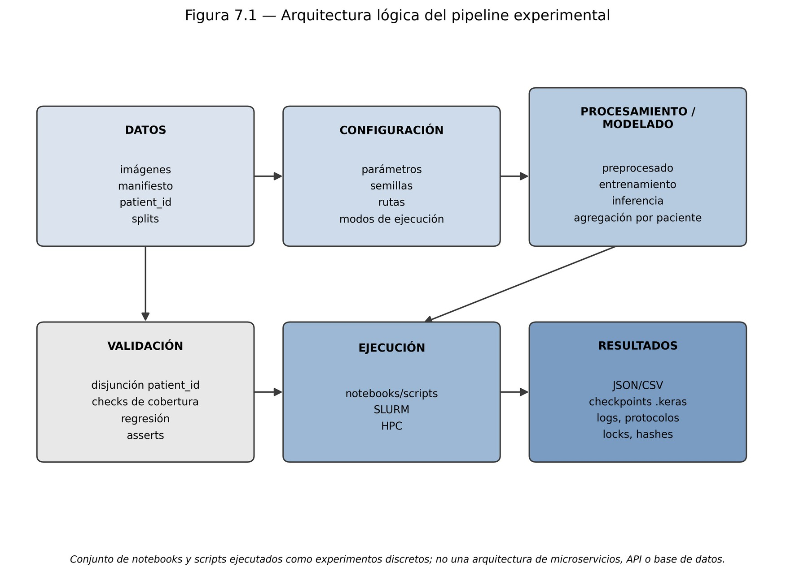
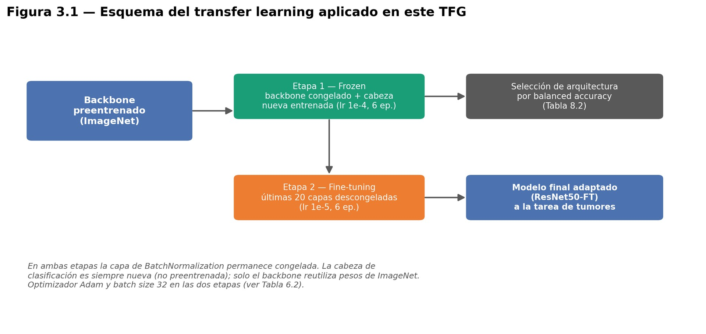
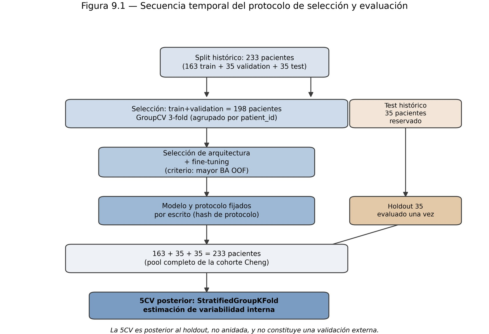

# 3. Metodología de Deep Learning

Fuente: capítulos 7, 8 y 9 de la memoria; Anexos C y H.

<p align="center"></p>

## 3.1 Entrada al modelo

| Paso | Detalle |
|---|---|
| Imagen | PNG 8 bits 256×256 (ver [02_datos.md](02_datos.md#23-preprocesado-de-cada-corte-igual-para-todo-el-proyecto)) |
| Redimensionado | 224×224, bilineal |
| Canales | El canal gris se **replica** 3 veces (las redes de ImageNet esperan RGB; no se añade información) |
| Normalización | `tf.keras.applications.resnet50.preprocess_input` |
| Aumento de datos (solo entrenamiento) | `RandomFlip("horizontal")`, `RandomRotation(0.03)`, `RandomZoom(0.10)`, `RandomTranslation(0.05, 0.05)`, `RandomContrast(0.10)` (código real de `ejecutar_fold_5cv_robustez.py`) |

No se aplicó corrección de campo de sesgo, registro, segmentación previa, z-score ni CLAHE.

## 3.2 Transfer learning en dos fases

<p align="center"></p>

**Cabeza común** a todas las arquitecturas:

```
backbone (ImageNet, sin top)
 → GlobalAveragePooling2D
 → Dropout(0.4)
 → Dense(128, ReLU)
 → Dropout(0.3)
 → Dense(3, softmax)          # glioma, meningioma, pituitario
pérdida: sparse_categorical_crossentropy · batch 32
```

| | Fase 1: cabeza | Fase 2: fine-tuning |
|---|---|---|
| Backbone | congelado | **últimas 20 capas que no son BatchNormalization** descongeladas |
| BatchNormalization | congelada | **congelada** (verificado en los artefactos) |
| Optimizador | Adam 1e‑4 | Adam 1e‑5 |
| Épocas (modelo final y 5CV) | 6 | 6 |
| Parámetros entrenables (ResNet50) | 262.659 | 14.691.331 (de 23.850.371) |

El número de épocas del modelo final (6 + 6) se fijó como la **mediana** de las mejores épocas observadas en los folds de selección ([5, 9, 6] y [7, 3, 6]), antes de abrir el test.

## 3.3 Selección de arquitectura (sin tocar el test)

- Candidatas: **VGG16, ResNet50, MobileNetV2, EfficientNetB0, InceptionV3** (familias distintas: clásica, residual, eficiente, escalado compuesto, multiescala).
- Protocolo: validación cruzada **agrupada por paciente** (StratifiedGroupKFold, 3 folds) sobre los **198 pacientes** de train+val, con predicciones fuera de fold (OOF). El test de 35 pacientes, bloqueado.
- Fase *frozen* de las 5 → fine-tuning de las 2 mejores ([protocolo C.3](protocolos/C3_fine_tuning_candidatos.md)) → fusión 50/50 ([protocolo C.4](protocolos/C4_combinacion_modelos.md)) → gana la de mayor balanced accuracy OOF.

<p align="center"></p>

## 3.4 Evaluación a nivel de paciente

El modelo predice por corte, pero se evalúa por **paciente**:

```python
# Anexo H.1 — única regla de agregación implementada
agr = cortes.groupby("patient_id").agg({"p_glioma":"mean", "p_meningioma":"mean", "p_pituitario":"mean"})
pred_paciente = agr.values.argmax(1)
balanced_accuracy_score(real_paciente, pred_paciente)   # media del recall por clase
```

| Métrica | Papel |
|---|---|
| **Balanced accuracy** (media no ponderada del recall de las 3 clases) | principal |
| Accuracy | secundaria |
| Macro-F1 | secundaria |
| Recall/precisión por clase, matriz de confusión, IC95 % bootstrap (2.000 réplicas) | complementarias |

> Ojo al comparar: en la tarea binaria histórica "balanced accuracy" era (sensibilidad + especificidad)/2; en multiclase es la media de recalls. Mismo nombre, distinta fórmula.

## 3.5 Explicabilidad (Grad-CAM)

Grad-CAM sobre la última capa convolucional localizada dinámicamente (`conv5_block3_out` en ResNet50). Se usa **solo como análisis cualitativo post-hoc**: no se comparó con las máscaras tumorales del dataset, así que no demuestra que el modelo "localice" el tumor. El backend de Cloud Run genera el mismo tipo de mapa para cada predicción.

## 3.6 Trazabilidad y controles automáticos

| Mecanismo | Qué protege |
|---|---|
| `manifest_hash`, `split_hash`, `config_hash` | De qué datos, reparto y configuración sale cada resultado |
| SHA‑256 de checkpoints, protocolos y scripts | Que un fichero no haya cambiado |
| `FINAL_TEST_STARTED.lock` / `FINAL_TEST_COMPLETED.lock` | Que el test se abra una sola vez y con el mismo modelo/protocolo/split |
| `assert` de disjunción de pacientes y cobertura de los 233 | Que no haya fuga ni pacientes perdidos |
| `assert` del nº de parámetros | Que la arquitectura cargada es la esperada |
| Control de regresión (±0,03) contra el baseline histórico (79,66 %) | Que el framework reconstruido reproduce resultados previos; lanza `RuntimeError` si no |

## 3.7 Ejecución en HPC

Cada experimento es un job SLURM no interactivo que ejecuta el notebook con `jupyter nbconvert --execute` (o un script Python) y guarda sus logs `.out/.err`. 16 jobs documentados (Anexo B). Entorno: Python 3.10.8, TensorFlow 2.15.1, CUDA 12.2, NVIDIA A30 24 GB.

```bash
#SBATCH --partition=main
#SBATCH --gres=gpu:a30:1
#SBATCH --cpus-per-task=8
#SBATCH --mem=64G
#SBATCH --time=02:00:00
```

**Determinismo:** se fijaron semillas, pero no el determinismo estricto de GPU. Reproducir el procedimiento no garantiza las mismas cifras al último decimal.
