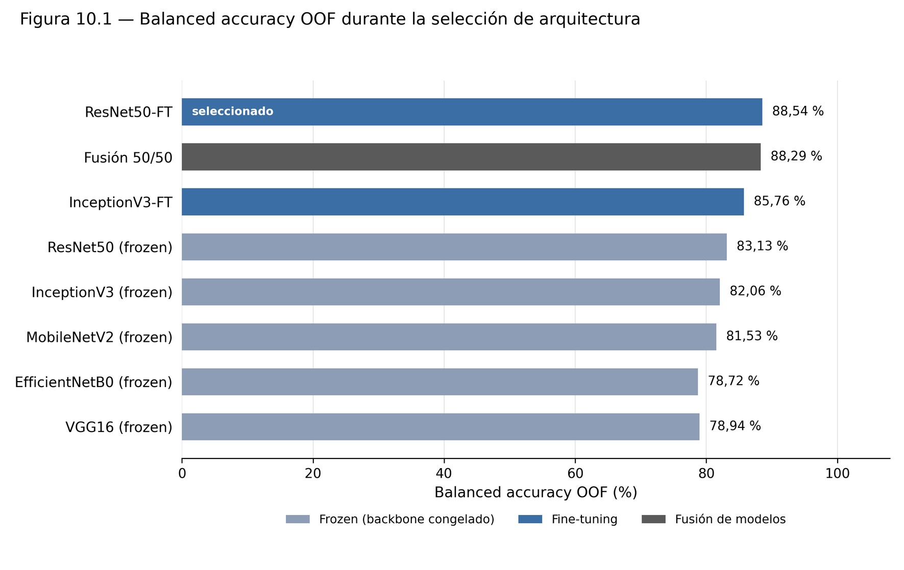
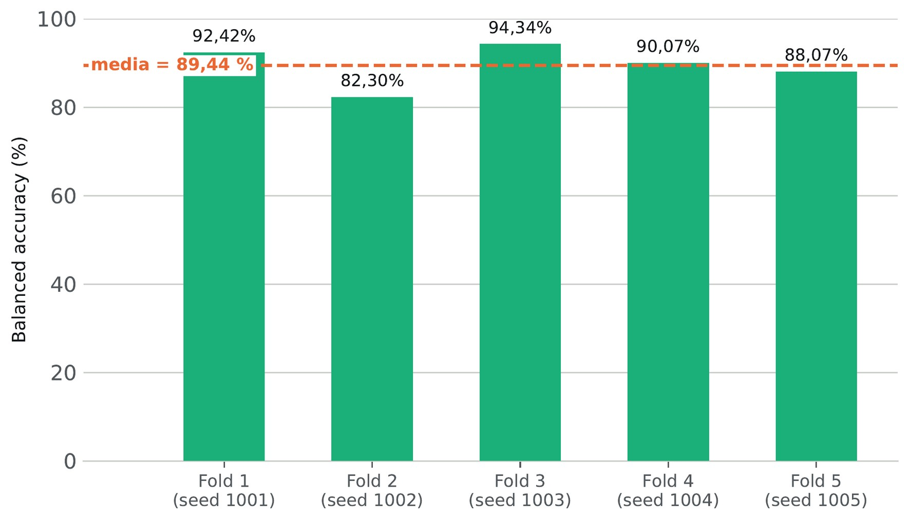
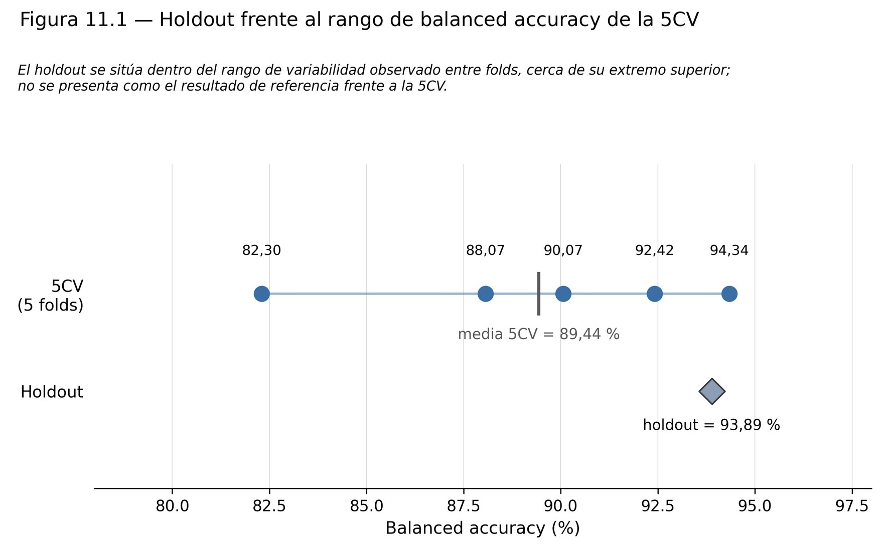

**Language:** [Español](../04_resultados.md) · **English** · [Français](../fr/04_resultats.md)

# 4. Results

All figures come from Appendix D (verified result files). All of them are **patient-level**.

## 4.1 Historical baseline (custom CNN trained from scratch)

| Experiment | Balanced acc. | Set |
|---|---|---|
| Custom CNN (historical) | 79.66 % | historical test (35 patients) |
| Reproduction with the rebuilt framework | 74.44 % | same test (regression check) |

The difference (−5.21 pp) exceeded the ±0.03 tolerance and **the regression check automatically stopped** one of the runs (job 70886). It is documented as a limitation.

## 4.2 Architecture comparison (frozen backbone)

3 patient-grouped folds on 198 patients · test set locked.

| Model | OOF balanced acc. | Accuracy | Macro-F1 | Recall glioma | Recall mening. | Recall pituit. | Parameters |
|---|---|---|---|---|---|---|---|
| **ResNet50** | **83.13 %** | 81.31 % | 82.06 % | 79.22 % | 72.22 % | 97.96 % | 23.9 M |
| InceptionV3 | 82.06 % | 80.30 % | 80.40 % | 85.71 % | 62.50 % | 97.96 % | 22.1 M |
| MobileNetV2 | 81.53 % | 79.29 % | 79.45 % | 77.92 % | 66.67 % | 100.00 % | 2.4 M |
| VGG16 | 78.94 % | 76.77 % | 75.98 % | 89.61 % | 47.22 % | 100.00 % | 14.8 M |
| EfficientNetB0 | 78.72 % | 76.26 % | 75.90 % | 79.22 % | 56.94 % | 100.00 % | 4.2 M |

## 4.3 Fine-tuning and ensemble

| Model | OOF balanced acc. | Accuracy | Macro-F1 |
|---|---|---|---|
| **ResNet50 with fine-tuning** | **88.54 %** | 87.37 % | 88.02 % |
| 50/50 ensemble (ResNet50‑FT + InceptionV3‑FT) | 88.29 % | 87.37 % | 87.92 % |
| InceptionV3 with fine-tuning | 85.76 % | 84.34 % | 84.85 % |

The ensemble does not beat the best single model → **ResNet50‑FT** is selected.

<p align="center"></p>

## 4.4 Final evaluation on the held-out test set (only once)

| Metric | Value |
|---|---|
| Patients / slices | 35 / 474 |
| **Balanced accuracy** | **93.89 %** |
| Accuracy | 94.29 % |
| Macro-F1 | 93.98 % |
| Recall glioma / meningioma / pituitary | 91.67 % / 90.00 % / 100.00 % |
| Precision glioma / meningioma / pituitary | 100.00 % / 90.00 % / 92.86 % |
| 95 % bootstrap CI (2,000 resamples) of balanced acc. | [84.26 %, 100.00 %] |

Confusion matrix (rows = true, columns = predicted; glioma / meningioma / pituitary):

```
[[11, 1, 0],
 [ 0, 9, 1],
 [ 0, 0, 13]]
```

33 of 35 patients correct. Errors: one meningioma predicted as pituitary (confidence 0.82, 8 slices) and one glioma predicted as meningioma (confidence 0.46, the lowest in the test set, 2 slices).

## 4.5 Robustness cross-validation (5 folds, 233 patients)

Run **after** the model was fixed, without revisiting the selection. A new model per fold, starting from the ImageNet weights. Files in [`results/robustez_5cv/`](../../results/robustez_5cv).

| Fold | Seed | Train / eval patients | Balanced acc. | Accuracy | Macro-F1 |
|---|---|---|---|---|---|
| 1 | 1001 | 186 / 47 | 92.42 % | 89.36 % | 90.11 % |
| 2 | 1002 | 186 / 47 | 82.30 % | 80.85 % | 80.32 % |
| 3 | 1003 | 187 / 46 | 94.34 % | 93.48 % | 94.29 % |
| 4 | 1004 | 186 / 47 | 90.07 % | 89.36 % | 89.43 % |
| 5 | 1005 | 187 / 46 | 88.07 % | 86.96 % | 87.07 % |
| **Mean ± SD** | | | **89.44 % ± 4.64 pp** | 88.00 % ± 4.63 pp | 88.24 % ± 5.14 pp |

Over the **233 pooled predictions** (each patient evaluated once by a model that never saw it): balanced accuracy **88.68 %**, accuracy 87.98 %, macro-F1 88.21 %, 205/233 patients correct.

```
[[79,  9,  1],
 [ 9, 66,  7],
 [ 1,  1, 60]]
```

<p align="center"> </p>

**How to read it:** the 93.89 % test result sits near the top of the fold range (82.30 %–94.34 %). The more cautious estimate of performance within this cohort is the 5CV one. The hardest class is **meningioma** (confused with pituitary, especially in fold 2).

## 4.6 Grad-CAM

<p align="center"></p>

Five test cases: three correct predictions (one per class) and the two errors. In the correct cases the confidence is > 0.90; in one of the errors the model is wrong with 0.82 confidence, a reminder that **high confidence does not mean correct**. Full gallery in Appendix E.
