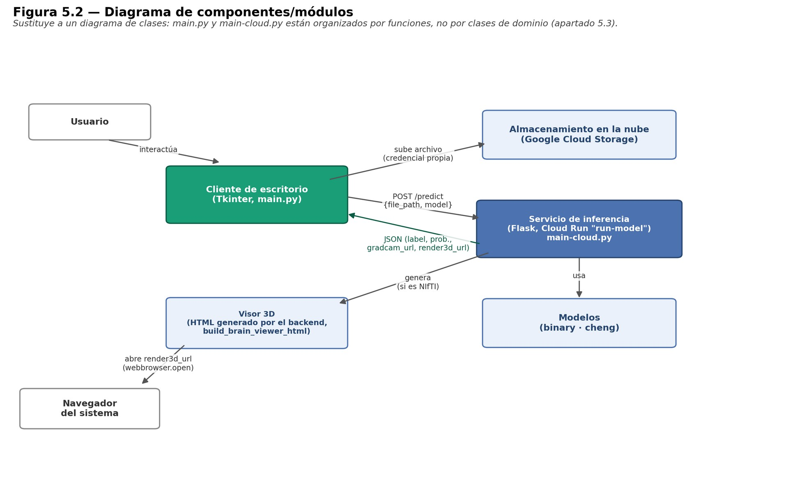
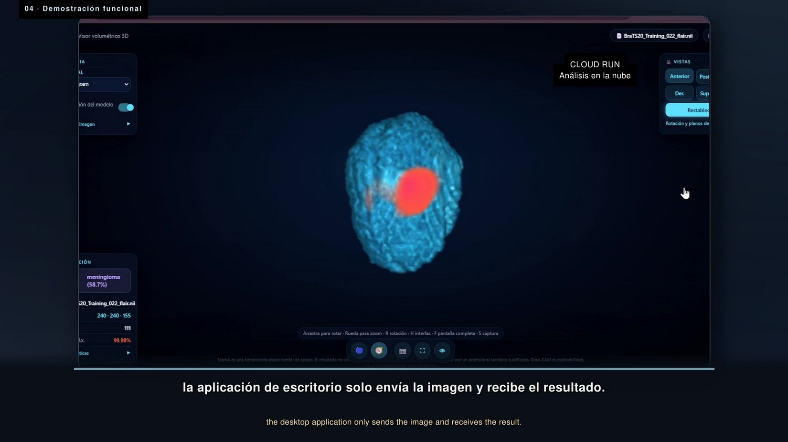

**Langue :** [Español](../06_despliegue_google_cloud.md) · [English](../en/06_google_cloud_deployment.md) · **Français**

# 6. Monter votre propre service Google Cloud Run et l'application de bureau

Ce guide déploie depuis zéro la même architecture que celle du TFG (chapitre 5 et annexe J) : une application de bureau qui envoie l'image vers Cloud Storage et une API Cloud Run qui la classe.

<p align="center"></p>

```
Application de bureau (Tkinter)
  1. envoie l'image/NIfTI  ──►  bucket GRADCAM_2D / RENDER_3D  (Cloud Storage)
  2. POST /predict {"file_path": "gs://…", "model": "cheng"}  ──►  Cloud Run "run-model"
                                                                  ├─ télécharge le modèle .h5 depuis MODEL_BUCKET (une fois)
                                                                  ├─ prédit + Grad-CAM (ou visionneuse 3D si NIfTI)
                                                                  └─ envoie le résultat dans le bucket et renvoie un JSON avec les URL
  3. affiche la prédiction, les probabilités et le Grad-CAM ; ouvre la visionneuse 3D dans le navigateur
```

> ⚠️ **Confidentialité.** Tel qu'il est conçu, les buckets de résultats sont **lisibles publiquement** (les URL du Grad-CAM et de la visionneuse 3D s'ouvrent directement). N'envoyez pas d'images de vrais patients. Utilisez uniquement des données publiques comme celles de Cheng.

## 6.1 Prérequis

- Un compte Google Cloud avec la facturation activée (Cloud Run a un niveau gratuit, mais avec 8 Gio de mémoire chaque requête consomme des ressources).
- La [Google Cloud CLI (`gcloud`)](https://cloud.google.com/sdk/docs/install) installée et connectée : `gcloud auth login`.
- Les modèles :
  - `resnet50_ft_cheng_final.h5` (multiclasse, modèle final). Téléchargez-le depuis la section **Releases** de ce dépôt ou générez-le avec `training/entrenar_modelo_final.py`.
  - `brain_tumor_cnn.h5` (binaire historique). Facultatif, mais le backend l'utilise par défaut si aucun modèle n'est indiqué et **toujours** pour les volumes NIfTI. Rappelez-vous qu'il provient de la tâche binaire affectée par le biais de provenance (voir [01](01_historique_du_projet.md#étape-3--le-biais-de-provenance-et-pourquoi-la-tâche-binaire-a-été-abandonnée)).

## 6.2 Variables (remplacez-les par les vôtres)

Les noms de bucket sont **uniques dans tout Google Cloud** : vous ne pouvez pas réutiliser ceux du TFG.

```bash
export PROJECT_ID="mon-projet-tumeurs"
export REGION="us-central1"
export MODEL_BUCKET="${PROJECT_ID}-modeles"
export BUCKET_2D="${PROJECT_ID}-heatmap"
export BUCKET_3D="${PROJECT_ID}-render3d"
```

## 6.3 Projet et API

```bash
gcloud projects create $PROJECT_ID            # ou utilisez un projet existant
gcloud config set project $PROJECT_ID
gcloud services enable run.googleapis.com cloudbuild.googleapis.com \
    artifactregistry.googleapis.com storage.googleapis.com iam.googleapis.com
```

## 6.4 Buckets

```bash
# Modèles : privé
gcloud storage buckets create gs://$MODEL_BUCKET --location=$REGION --uniform-bucket-level-access

# Résultats : lecture publique (le backend renvoie des URL https://storage.googleapis.com/...)
for B in $BUCKET_2D $BUCKET_3D; do
  gcloud storage buckets create gs://$B --location=$REGION --uniform-bucket-level-access
  gcloud storage buckets add-iam-policy-binding gs://$B --member=allUsers --role=roles/storage.objectViewer
done

# Recommandé : supprimer automatiquement les fichiers envoyés au bout d'1 jour
echo '{"rule":[{"action":{"type":"Delete"},"condition":{"age":1}}]}' > lifecycle.json
gcloud storage buckets update gs://$BUCKET_2D --lifecycle-file=lifecycle.json
gcloud storage buckets update gs://$BUCKET_3D --lifecycle-file=lifecycle.json
```

Envoyez les modèles :

```bash
gcloud storage cp resnet50_ft_cheng_final.h5 brain_tumor_cnn.h5 gs://$MODEL_BUCKET/
```

## 6.5 Compte de service du backend

```bash
gcloud iam service-accounts create run-model-sa --display-name="Cloud Run run-model"
SA="run-model-sa@${PROJECT_ID}.iam.gserviceaccount.com"
gcloud storage buckets add-iam-policy-binding gs://$MODEL_BUCKET --member="serviceAccount:$SA" --role=roles/storage.objectViewer
for B in $BUCKET_2D $BUCKET_3D; do
  gcloud storage buckets add-iam-policy-binding gs://$B --member="serviceAccount:$SA" --role=roles/storage.objectAdmin
done
```

Le backend ne contient aucune clé dans son code : il utilise l'identité de ce compte de service.

## 6.6 Déployer l'API

```bash
cd cloud-run-backend
gcloud run deploy run-model \
  --source . \
  --region $REGION \
  --service-account $SA \
  --memory 8Gi --cpu 2 \
  --concurrency 1 \
  --timeout 900 \
  --set-env-vars MODEL_BUCKET=$MODEL_BUCKET,BUCKET_GRADCAM_2D=$BUCKET_2D,BUCKET_RENDER_3D=$BUCKET_3D,WEB_CONCURRENCY=1 \
  --allow-unauthenticated
```

- `--source .` construit l'image avec Cloud Build à partir de `requirements.txt` et du `Procfile` (gunicorn avec **un seul worker**).
- `--memory 8Gi`, `--concurrency 1` et `WEB_CONCURRENCY=1` constituent la correction de l'incident de production décrit plus bas. Ne les réduisez pas.
- `--allow-unauthenticated` laisse l'API ouverte à quiconque connaît l'URL. Pour un usage privé, retirez-le et appelez l'API avec un jeton d'identité.

À la fin, `gcloud` affiche l'URL du service (`https://run-model-xxxxx.run.app`).

## 6.7 Tester l'API

```bash
URL=$(gcloud run services describe run-model --region $REGION --format='value(status.url)')
curl $URL/health

# envoyez une image de test et demandez la prédiction du modèle multiclasse
gcloud storage cp exemple.png gs://$BUCKET_2D/tests/exemple.png
curl -X POST $URL/predict -H "Content-Type: application/json" \
     -d "{\"image_path\": \"gs://$BUCKET_2D/tests/exemple.png\", \"model\": \"cheng\"}"
```

La première requête est plus lente (démarrage à froid : téléchargement et chargement du modèle d'environ 170 Mo).

## 6.8 Configurer l'application de bureau

1. **Compte de service du client** (ne peut qu'envoyer des fichiers) :

   ```bash
   gcloud iam service-accounts create scania-client
   CSA="scania-client@${PROJECT_ID}.iam.gserviceaccount.com"
   for B in $BUCKET_2D $BUCKET_3D; do
     gcloud storage buckets add-iam-policy-binding gs://$B --member="serviceAccount:$CSA" --role=roles/storage.objectCreator
   done
   gcloud iam service-accounts keys create desktop-client/gcp-service-account.json --iam-account=$CSA
   ```

   Ce JSON est une **clé privée** : il est dans `.gitignore`, ne l'envoyez jamais sur GitHub. S'il fuit, révoquez-le dans *IAM → Comptes de service → Clés*.

2. **Buckets et URL** : définissez ces variables d'environnement avant d'ouvrir l'application (sous Windows, `set VAR=valeur` dans la même console) :

   ```bash
   export SCANIA_BUCKET_2D=$BUCKET_2D
   export SCANIA_BUCKET_3D=$BUCKET_3D
   export SCANIA_API_URL="$URL/predict"
   ```

3. L'URL peut aussi être modifiée dans l'application (*Settings*) ou en copiant `config.example.json` vers `config.json` et en modifiant `api_url` ; cette valeur est conservée entre les sessions.

4. Installez et lancez (voir [`desktop-client/README.fr.md`](../../desktop-client/README.fr.md)) :

   ```bash
   cd desktop-client
   python -m venv myenv && myenv\Scripts\activate      # Windows
   pip install -r requirements.txt
   python main.py
   ```

<p align="center"> </p>

## Problème connu : erreur 503

**Symptôme :** le service renvoyait 503 à la réception des requêtes. **Cause :** avec 4 Gio de mémoire, gunicorn lançait plusieurs workers et chacun chargeait sa propre copie de ResNet50 ; ensemble, ils épuisaient la mémoire du conteneur. **Correction appliquée** (24/09/2026, révision `run-model-00062-p5z`, vérifiée avec `/health`) :

```bash
gcloud run services update run-model --memory=8Gi --concurrency=1 --update-env-vars=WEB_CONCURRENCY=1
```

## Différence connue entre entraînement et inférence

À l'entraînement, chaque coupe était recadrée sur la boîte englobante du cerveau et normalisée par les percentiles 1–99 avant le redimensionnement ([02_donnees.md](02_donnees.md#23-prétraitement-de-chaque-coupe-identique-pour-tout-le-projet)). Pour les images 2D isolées, le backend se contente de redimensionner à 224×224 et d'appliquer `preprocess_input`. Avec des images déjà recadrées (comme celles de Cheng), l'effet est faible, mais avec d'autres sources la prédiction peut se dégrader. Appliquer la même fonction `_a_png` dans le backend est une amélioration en attente.

## Coûts indicatifs

Avec `min-instances=0` (par défaut), vous ne payez que pendant le traitement d'une requête, mais chaque démarrage à froid retélécharge le modèle. Pour une démo, le coût reste en général dans le niveau gratuit ou à quelques centimes ; consultez le [simulateur de prix](https://cloud.google.com/products/calculator) avant de le laisser ouvert.
